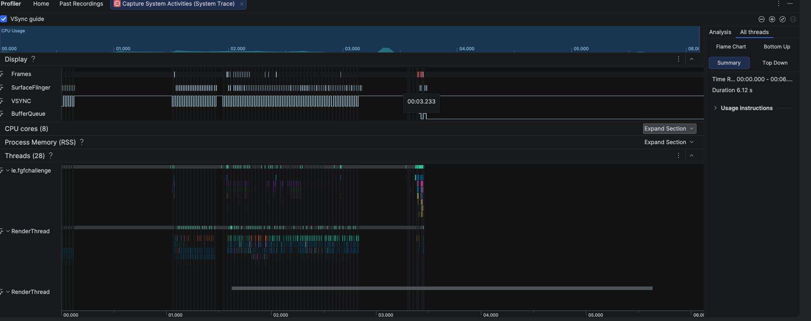
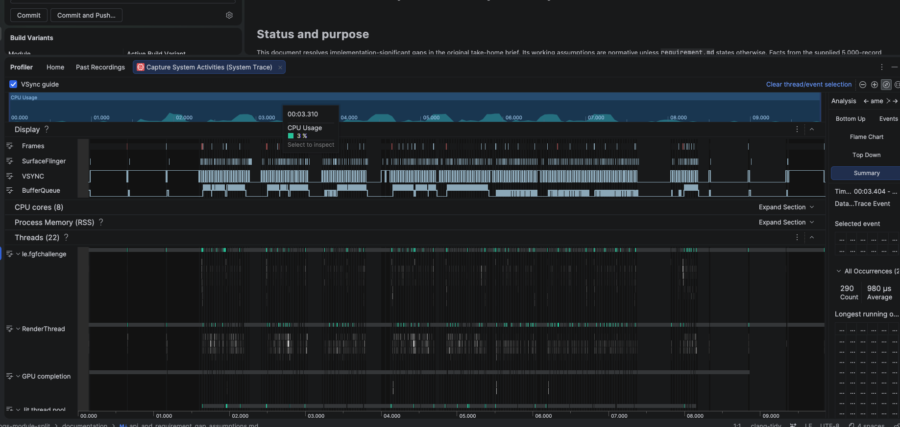
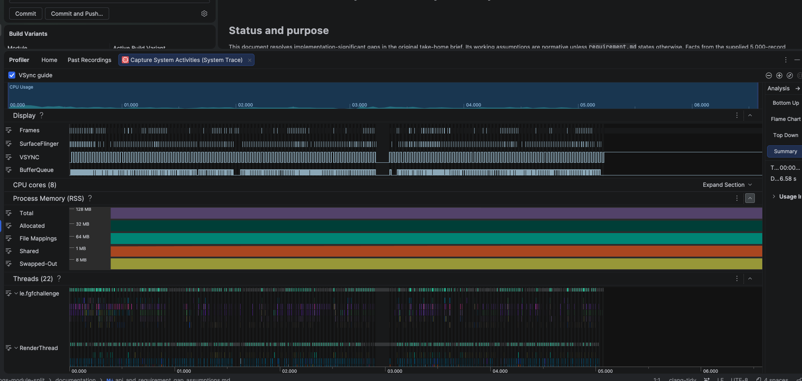
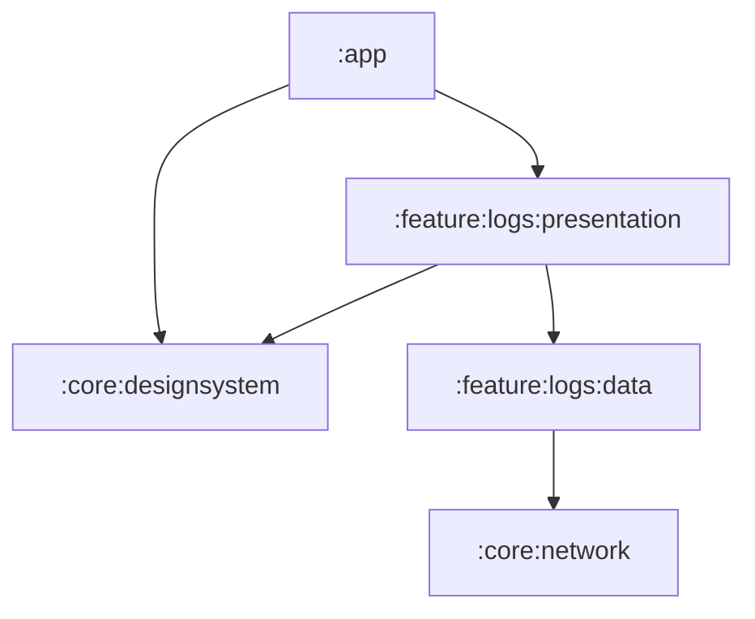

# AI Semantic Log

> Android take-home prototype · Jetpack Compose · Room · Paging 3 · Hilt

A responsive log viewer for a complete structured snapshot. Each launch fetches
the supplied payload, maps it, and atomically replaces a feature-owned Room
snapshot. From then on, Room is the source of truth for the list, aggregates,
filter options, and details.

The supplied endpoint provides the 5,000-record schema fixture. The design
keeps the UI bounded for larger snapshots, and the benchmark variant exercises
a deterministic 100,000-row Room fixture.

## Demo

[▶ Watch the 720p screen recording](documentation/demo/ai-semantic-log-demo.mov)

The recording shows the paged log viewer, literal search, structured filters,
sorting, aggregate severity feedback, and details.

## Performance and profiler evidence

The Macrobenchmark suite was recorded on the documented physical One
UI 2.5 baseline device (Galaxy S9+ / API 29) using the **100,000-row** benchmark
fixture and ten measured iterations per scenario.

| Scenario | Observation                                                                                                 |
| --- |-------------------------------------------------------------------------------------------------------------|
| Combined filter | **12.55 ms** for tag, severity, and AI-generated predicates, including aggregate, first page, and redraw.   |
| Scroll | **6.59 ms frame time**; **1.9%** of frames (7/370) exceeded the 16.7 ms / 60 Hz budget.                     |
| Literal search | **8.65ms** for `timed out` across 20,020 matches, including debounce, aggregate, first page, and UI update. |

Manual Android Studio System Trace captures against the same simulated fixture **100,000-row**
showed no significant dropped frames while filtering, searching, or scrolling.

| Filtering latency | Search | Scroll |
| --- | --- | --- |
|  |  |  |

See the [Macrobenchmark runbook](documentation/performanceBenchmark.md) for
device controls, scenarios, metrics, and comparison rules. Raw traces and run
records stay local and are intentionally git-ignored.

## Architecture

The project uses Google's layered Android architecture with unidirectional data
flow. It deliberately avoids a standalone domain layer: a single screen's
query coordination is clearer in its ViewModel until reuse or complexity
justifies another boundary.



| Module | Responsibility |
| --- | --- |
| `:app` | Hilt composition root, single activity, theme, and feature assembly. |
| `:feature:logs:presentation` | ViewModel, immutable UI state, Compose UI, and visual/interaction tests. |
| `:feature:logs:data` | Repository contract, Room, API/DTOs, mappings, queries, and data tests. |
| `:core:network` | Shared Retrofit, OkHttp, and Kotlinx Serialization setup. |
| `:core:designsystem` | Stateless Material 3 theme and reusable UI components with no feature, Room, or Paging dependency. |
| `:benchmark` | Optional release-like Macrobenchmark target; not a shipping dependency. |

Presentation knows only repository-facing models. DTOs, Room entities, DAOs,
dynamic SQL, and infrastructure exceptions remain inside the data module.

## Data lifecycle and Paging 3

1. The app fetches one complete remote snapshot at launch, then decodes and
   maps it before any database mutation.
2. Room replaces the previous snapshot in one transaction. A failed or
   cancelled refresh leaves the prior complete snapshot intact and exposes a
   retryable launch error instead of presenting retained data as current.
3. One immutable `LogQuery` drives logically identical predicates for paged
   rows and full-result aggregates, so counts always describe the current
   filter—not only the loaded window.
4. Paging 3 loads 100 rows initially and per page, prefetching before the last
   20–30 rows. Its `Flow<PagingData<…>>` is separate from bounded UI state;
   the UI never stores all rows or matches in memory.

Rows are deterministically ordered by UTC timestamp and log ID, grouped by UTC
minute in one paging-aware `LazyColumn`, and keyed by stable ID. The summary
and Canvas severity indicator use the complete Room result; error density is
`(ERROR + FATAL) / total`, including rows not yet loaded.

## Search and structured filtering

- Search is a case-insensitive **literal** substring over `message` or log
  `id` only. `%` and `_` stay literal; tag and severity never leak into free
  text search.
- Tags, severities, AI-generated state, UTC date/time, and latency have their
  own controls in the Filter sheet. This matches the input type and keeps
  search-as-you-type focused on one narrow, predictable predicate.
- Active filter categories combine with **AND**; selected values inside one
  category combine with **OR** / `IN`. Filter edits remain local drafts until
  **Apply**, avoiding database work for every chip or range-slider change.
- A user-facing UTC end minute is inclusive. Sorting is newest-first by default
  and always deterministic by timestamp then ID.

## Quality and verification

- Focused JVM tests cover mapping, query construction, snapshot replacement,
  retry behavior, and ViewModel coordination.
- Paparazzi verifies representative loading, error, content, filtered,
  no-result, refresh, append, and light/dark screen states.
- Existing instrumented Compose interaction coverage is retained.
- A repository pre-commit hook runs Kotlin formatting checks and Android Lint;
  it checks only and never reformats or stages files.

## Run locally

**Requirements:** Android Studio compatible with AGP 9.3.1, JDK 21, and Android
SDK platform 37.

```bash
git config core.hooksPath .githooks
./gradlew :app:assembleDebug
./gradlew :app:installDebug
```

| Purpose | Command |
| --- | --- |
| JVM unit tests | `./gradlew testDebugUnitTest` |
| Verify visual goldens | `./gradlew :feature:logs:presentation:verifyPaparazziDebug` |
| Kotlin/Gradle formatting check | `./gradlew ktlintCheck` |
| Android Lint | `./gradlew lintDebug` |
| Instrumented tests | `./gradlew :app:connectedDebugAndroidTest` |
| Benchmark fixture contract | `./gradlew :feature:logs:data:testBenchmarkUnitTest` |

## Scope

This is intentionally a focused prototype. It does not add remote pagination
or streaming, background/delta sync, offline-first behavior, runtime AI,
semantic/vector search, anomaly detection, analytics, or production
observability. Paging is client-side over Room after the one-shot snapshot
refresh.

## Further reading

- [Product requirements](documentation/requirement.md)
- [Architecture](documentation/ARCHITECTURE.md)
- [Product and API assumptions](documentation/api_and_requirement_gap_assumptions.md)
- [Implementation roadmap](documentation/implementationRoadMap.md)

## AI assistance

Claude Code, ChatGPT, and Codex materially contributed to the architecture,
implementation, debugging, testing, and documentation. The tool, task, and
key prompt for each material session are recorded in [PROMPTS.md](PROMPTS.md).
