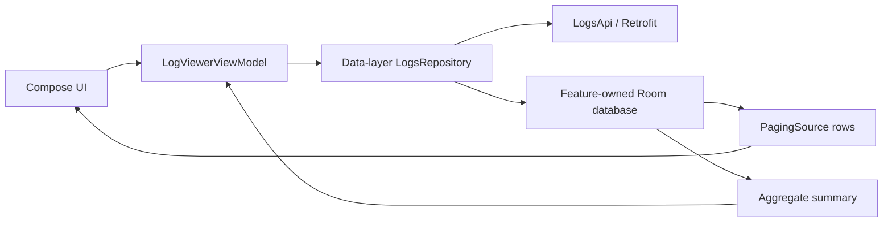
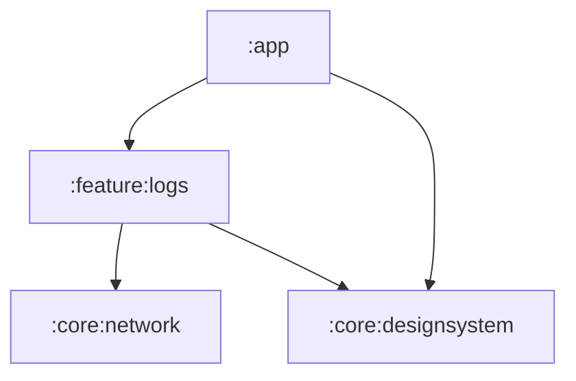
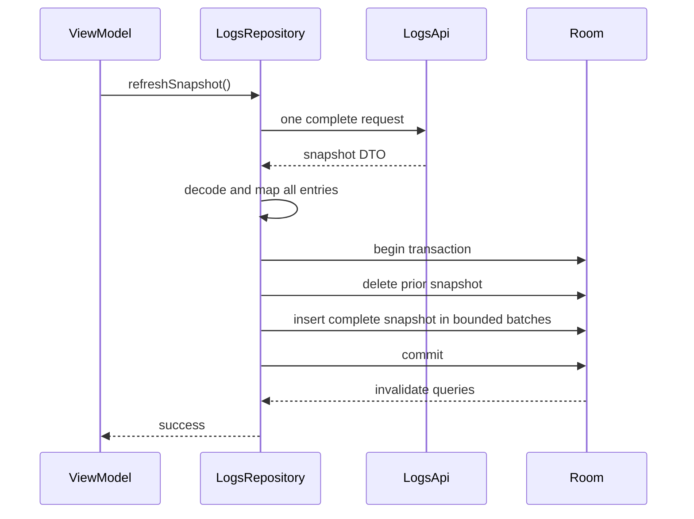

# AI Semantic Log Architecture

## Status and purpose

This document records the approved architecture for the revised Android take-home prototype. It replaces the original approximately 5,000-record in-memory design with a Room/Paging design that can remain bounded for larger snapshots; performance exploration is an optional test rather than a delivery gate.

Product decisions are authoritative in this order:

1. [`requirement.md`](requirement.md)
2. [`api_and_requirement_gap_assumptions.md`](api_and_requirement_gap_assumptions.md)
3. [`UIWireframe.png`](UIWireframe.png)
4. this document

The supplied 5,000-record endpoint remains the primary schema and development fixture. It is not permission to retain a full snapshot or every match in presentation state.

## Architectural position

The app follows Google's layered Android architecture with unidirectional data flow:

- presentation renders immutable state and forwards actions;
- the ViewModel derives one immutable query value from the current UI inputs;
- the data-layer repository remains the only public data boundary;
- Retrofit supplies one complete remote snapshot;
- feature-owned Room is the post-refresh source of truth;
- Paging 3 owns the bounded list working set;
- Coroutines and Flow carry asynchronous and observable values.



No standalone domain layer is required for this one-screen prototype. The ViewModel can derive the immutable `LogQuery` and coordinate its repository streams directly; add a domain boundary only when a later feature creates genuine reuse or complexity.

## Scope and invariants

The app will:

- fetch one complete remote snapshot per app launch;
- decode and map the response before local mutation;
- atomically replace the prior Room snapshot;
- query Room for free text, structured filters, deterministic ordering, rows, counts, options, and details;
- initially load 100 matching rows and append in pages of 100;
- group paged rows into UTC minute buckets;
- calculate full-result severity counts and `(ERROR + FATAL) / total` density;
- support startup, refresh, append, empty, error, retry, and details states;
- avoid complete-result collections in presentation state.

The architecture preserves these invariants:

- Remote pagination, deltas, and streaming are not introduced.
- Exactly one automatic refresh is attempted per app launch; another attempt requires Retry.
- Room changes only after the response has decoded and mapped successfully.
- Snapshot deletion and insertion occur in one transaction, so failure or cancellation leaves the prior snapshot unchanged.
- Retained data after a failed launch is not silently represented as a current successful refresh.
- After refresh succeeds, Room is the only source for rows, summaries, filter options, and details.
- Paged rows and aggregate summaries use the same immutable query criteria and logically identical predicates.
- Runtime AI, semantic/vector search, anomaly detection, clustering, analytics, offline-first behavior, and production observability remain out of scope.

## Gradle modules

The existing four-module graph remains sufficient:

```text
:app
    -> :feature:logs
    -> :core:designsystem

:feature:logs
    -> :core:network
    -> :core:designsystem

:core:network
    -> no app or feature module

:core:designsystem
    -> no app or feature module
```



Room and Paging are feature-specific dependencies in `:feature:logs`. A generic `:core:database` module is not created without a second consumer.

### `:app`

Owns:

- the Hilt `Application` entry point;
- the single `MainActivity`;
- application theme invocation;
- composition of `LogsFeature`.

The app has one activity and one destination, so a navigation framework remains unnecessary. The launch refresh is owned by the screen/application lifetime rather than a recomposition, and configuration changes do not create duplicate automatic requests.

### `:core:network`

Owns reusable network construction only:

- configured Kotlinx Serialization `Json`;
- `OkHttpClient` construction and timeouts;
- `Retrofit` construction;
- debug-only BASIC request/response logging without response bodies.

It does not know about the logs endpoint, DTOs, Room, repository failures, or presentation state.

### `:core:designsystem`

Owns fixed light/dark Material 3 themes, typography, shapes, spacing, and stateless display components. Existing rows, minute headers, badges, search, severity indicator, loading/error/no-results content, and details visuals remain here. Reusable filter primitives and Paging boundary content may be added here when they are independent of feature/data types.

Design-system components accept display-ready values and callbacks. They do not import feature state, ViewModels, repository models, Room, DAO/entity types, or Paging types. Dynamic color remains excluded so severity colors and visual tests are deterministic.

### `:feature:logs`

Contains data and presentation. It exposes only `LogsFeature` to `:app`.

```text
feature/logs/
    LogsFeature.kt

    data/
        remote/         LogsApi and serializable snapshot DTOs
        local/          Room database, DAO, entities, and query builder
        model/          Immutable repository-facing entries, query, summary, and options
        mapper/         Remote/entity boundary mapping
        repository/     LogsRepository and SnapshotLogsRepository
        error/          Feature-local Result and LogsDataError
        di/             LogsDataModule

    presentation/
        model/          Display-ready rows, filter models, summary, and list items
        LogViewerAction
        LogViewerUiState
        LogViewerViewModel
        LogViewerScreen
```

Exact filenames are selected in the implementation plans. The ownership and dependency direction above are fixed.

## Layer responsibilities and dependency rules

### Presentation

Presentation owns:

- `LogViewerViewModel`, `LogViewerUiState`, and `LogViewerAction`;
- immediate text-field state and applied-versus-draft filter state;
- localized error text and display formatting;
- bounded selection/details state;
- mapping repository/application entries into display-ready paged list items;
- assembling Compose UI and rendering Paging load states.

Presentation derives an immutable `LogQuery` and calls repository operations for query-driven rows, summaries, refresh, options, and details. It never imports or calls `SnapshotLogsRepository`, `LogsApi`, DTOs, Room database/DAO/entity/query-builder types, Retrofit, OkHttp, or SQLite.

### Query coordination

The ViewModel keeps query coordination intentionally small:

- normalization of blank search, empty selections, and unconstrained values;
- creation of one canonical `LogQuery` value;
- coordination of the repository's paged and aggregate streams from that same value;
- replacement or cancellation of obsolete collections when the active query changes.

No new domain package, use-case layer, or pass-through action wrapper is required. `LogQuery` is an immutable repository input in `data/model` because `LogsRepository` owns the data contract; presentation owns only its simple derivation from screen state.

### Data

Data owns all external and persisted access:

- `LogsApi` and remote DTOs;
- Room database, entity, DAO, migrations, indexes, and parameterized query construction;
- `LogsRepository` and its multi-source `SnapshotLogsRepository` implementation;
- repository-facing immutable models;
- snapshot and entity mapping;
- atomic replacement and Room invalidation;
- translation of operational failures into the feature-local typed failure;
- Hilt bindings.

Remote DTOs, persistence entities, DAO types, dynamic SQL details, and infrastructure exceptions remain internal. Separate remote/local data-source interfaces are added only if multiple implementations or meaningful test/lifecycle isolation justify them; the repository boundary is mandatory, redundant wrappers are not.

## Data representations

### Remote snapshot

The remote contract retains:

```text
reportedTotalCount
sessionId
entries[]
    id
    timestamp
    severity
    tag
    message
    metadata.latencyMs
    metadata.isAiGenerated
```

DTO timestamps and severity values remain strings until mapping. Unknown JSON keys are ignored. A decoding or mapping failure is reported as the same retryable refresh failure as other basic data-access failures.

### Persistence entity

Each log entity stores every queryable/detail field:

```text
id: String (primary key)
timestampEpochMillis: Long
severity: String
tag: String
message: String
latencyMs: Int
isAiGenerated: Boolean
sessionId: String
```

Epoch milliseconds preserve the source precision required by the product and sort as UTC instants. Timestamp plus ID supplies deterministic ties. Start with the small set of indexes needed by the implemented queries; add more only if the supplied fixture reveals an actual problem.

### Repository-facing models

Data exposes immutable application-oriented values:

```text
LogEntry
    id
    timestamp: Instant
    severity: DEBUG | INFO | WARN | ERROR | FATAL | UNKNOWN
    tag
    message
    latencyMs
    isAiGenerated
    sessionId

LogQuery
    literalSearch
    selectedTags
    selectedSeverities
    aiGeneratedConstraint
    startInclusiveUtc
    endExclusiveUtc
    minimumLatencyInclusive
    maximumLatencyInclusive
    sortDirection

LogSummary
    totalCount
    countBySeverity

LogFilterOptions
    availableTags
    minimumLatency
    maximumLatency
```

`UNKNOWN` is valid application data, contributes to total and UNKNOWN counts, and is never silently classified as an error.

## Repository contract

`LogsRepository` remains the data layer's sole public boundary. Its conceptual operations are:

```kotlin
interface LogsRepository {
    suspend fun refreshSnapshot(): EmptyResult<LogsDataError>

    fun pagedLogs(query: LogQuery): Flow<PagingData<LogEntry>>

    fun summary(query: LogQuery): Flow<LogSummary>

    fun filterOptions(): Flow<LogFilterOptions>

    suspend fun logById(id: String): Result<LogEntry?, LogsDataError>
}
```

Names may be refined in the Step 7/8 implementation plan, but these distinct lifecycles and return shapes are architectural requirements:

- refresh is a one-shot suspending operation;
- rows, summaries, and options are observable Room-backed flows;
- details are a focused stable-ID lookup;
- no operation exposes DTOs, entities, DAOs, SQL, Retrofit, Room, or SQLite types.

`NetworkLogsRepository.getLogs()` is the completed Step 5 transitional contract. Step 8 replaces it with `SnapshotLogsRepository`, which coordinates the remote snapshot and Room rather than presenting the network as a source of truth.

## Startup refresh and atomic replacement



The response is decoded and mapped before the transaction begins. Batched entity mapping/insertion may bound temporary working copies, but all batches remain in the same transaction. Observers see the old complete snapshot or the new complete snapshot, never the delete/insert intermediate state.

Network, decoding/mapping, transaction, database, or cancellation failure before commit preserves the prior snapshot. The screen remains in retryable startup failure; the retained database is integrity/recovery state and is not labelled current. Retry repeats the complete operation.

Room invalidation after commit refreshes the active PagingSource, summary, filter options, and details lookups. No independent in-memory cache competes with Room.

## Database query policy

### Shared predicate construction

A single parameterized predicate builder produces the WHERE clause and bound arguments used by both paged and aggregate selects. User values are never concatenated into SQL. Dynamic `IN` lists use generated placeholders with bound values.

For normalized query `q`, a row matches when:

```text
(
    q.search is inactive
    OR message contains q.search literally, ignoring case
    OR id contains q.search literally, ignoring case
)
AND (q.tags is empty OR tag IN q.tags)
AND (q.severities is empty OR severity IN q.severities)
AND (q.ai constraint is inactive OR is_ai_generated = q.ai value)
AND (q.time range is inactive OR start <= timestamp < end)
AND (q.latency range is inactive OR min <= latency_ms <= max)
```

Search escaping occurs before binding: SQLite `%`, `_`, and the chosen escape character are escaped, then the value is wrapped for substring matching and queried with an explicit `ESCAPE` clause. Search remains case-insensitive literal matching over `message` and `id` only.

### UTC ranges

Timestamps remain UTC end to end. UI choices become one half-open interval:

- start is inclusive;
- an inclusive selected end minute becomes the next minute as the exclusive bound;
- a date-only end becomes the following UTC day's start;
- invalid or reversed ranges cannot reach the repository.

Latency bounds are inclusive. An unconstrained full-range selection normalizes to no latency predicate.

### Ordering and Paging

Every select orders by timestamp and ID in the chosen deterministic direction. Default is newest first.

Repository Pager configuration is:

```text
pageSize = 100
initialLoadSize = 100
prefetchDistance = 25
maxSize = 500
enablePlaceholders = false
```

The initial page therefore contains the newest 100 matches, or all matches when fewer exist. The next page is requested before the final 25 loaded rows are exhausted. The 500-row maximum targets a five-page active window and is above Paging's required 150-row minimum (`pageSize + 2 * prefetchDistance`), so old pages can be evicted and later reloaded from Room. Paging treats the cap as best effort to preserve its prefetch window, but the working set no longer grows with the complete result. Room supplies a `PagingSource`; snapshot replacement and query replacement invalidate obsolete sources.

### Aggregates and options

The aggregate path returns the complete filtered count and a count for each severity using the exact same predicate as the row path. Error density is derived from those complete-result counts:

```text
total == 0 -> 0%
otherwise  -> (ERROR + FATAL) / total
```

Neither `LazyPagingItems.itemCount` nor the currently loaded/visible rows may drive total count, severity counts, no-results state, or density.

Filter options are unfiltered snapshot metadata: distinct tags and dataset latency bounds. They are queried without loading every entity. The five known severity choices and AI tri-state are product-defined; an unexpected severity remains stored/counted as `UNKNOWN`.

## Query generation and cancellation

The ViewModel reflects typed search text immediately and derives one immutable `LogQuery` for the active inputs. A query change replaces the paged-row and aggregate-summary collections together; use a latest-generation mechanism when necessary to avoid showing results from an obsolete query.

Typed text reaches that derivation only once it settles: the state — and so the field — updates on the keystroke, while the query waits out a short pause in typing, since every distinct query starts both a new Pager and a new full-result aggregate. Blank text commits at once, as do the deliberate commits (filter Apply, Clear All, sort), which are never made to wait on a pause. Cancellation of superseded work is unchanged and still required: a debounce reduces how many generations are started, not the rule that a started one may be replaced.

The active generation passes the same query value to `pagedLogs(query)` and `summary(query)`. Presentation clears or marks the prior summary pending when criteria change so an old total is not labelled as belonging to new rows.

## Error handling

Expected network, HTTP, serialization, schema, Room, SQLite, and otherwise unclassified data-access failures are caught in data and mapped to the existing feature-local `LogsDataError`. That error remains a single retryable value while presentation behavior and copy are identical for every cause. A new case is justified only when retry, recovery, or user-facing behavior differs.

Coroutine cancellation is always rethrown before broad exception mapping. Neither cancellation nor a failed transaction is presented as ordinary successful content.

Paging refresh/append errors use generic load-state UI and Paging retry without exposing or branching on an infrastructure exception. An append failure retains loaded rows. Startup refresh failure is separate and gates whether the snapshot is considered current.

The typed `Result<T, E : Error>` and helpers remain feature-local. They are not network infrastructure and move to a shared module only if another feature genuinely reuses the convention.

## Unidirectional presentation state

`LogViewerViewModel` exposes exactly one immutable `StateFlow<LogViewerUiState>` for bounded screen state and a separate paged-list flow:

```text
StateFlow<LogViewerUiState>
    immediate search text
    applied filters
    filter draft and visibility
    active-filter count
    sort direction
    startup refresh state
    active-query summary state
    filter options
    selected log ID/details state

Flow<PagingData<LogViewerListItem>>
    minute headers
    display-ready log rows
```

`LogViewerUiState` never contains `PagingData`, the complete database, every match, or a materialized copy of loaded rows. The separate Paging flow is the deliberate exception to “all screen values in one state object” because Paging owns and evicts its bounded working set.

All user input is modelled as `LogViewerAction`, including:

- search text change and clear;
- open/dismiss filter sheet;
- edit filter draft;
- Apply and Clear All;
- sort change;
- startup Retry and Paging retry;
- row selection and details dismissal.

Selection is durable state, not a one-time event. Details are resolved by stable ID rather than scanning loaded pages. No event channel is required because this one-screen app has no navigation or transient action that cannot be represented as state.

The feature root obtains the Hilt ViewModel and collects state with lifecycle awareness. The screen composable receives immutable state, paged items/load state, and action callbacks, so it remains previewable and directly testable.

## Paging-aware UI architecture

The UI follows the revised wireframe and remains responsive:

- startup loading uses skeletons with no fabricated log values;
- startup error offers explicit Retry;
- content keeps the full-result summary, search, Filter with active count, and sort visible;
- the filter modal edits tags, five known severities, AI Any/Yes/No, UTC date/time, and inclusive latency draft values, then applies them together;
- one flat `LazyColumn` renders paging-aware stable keys and content types;
- non-collapsible UTC minute headers are inserted across page boundaries;
- Paging refresh, append progress, and append retry are visually distinct;
- append failure preserves loaded rows;
- no results appears only when the active aggregate completes with zero matches;
- the details sheet supports close, swipe-down, and Back dismissal.

Paging transformation maps `LogEntry` to `LogRowUi` and uses separator insertion for minute headers. Stable log IDs key rows; header keys incorporate the UTC minute. Composables format no database/application values and calculate no aggregates.

The Canvas severity indicator has a neutral circular track plus ERROR and FATAL arcs. Its percentage and adjacent legend come from the complete-result aggregate. Text labels ensure color is not the only carrier of meaning.

Use clear visible labels for controls and load-state actions. One representative screenshot test per screen is sufficient.

## Time and display formatting

UTC is preserved throughout:

- persistence sorts epoch milliseconds as UTC instants;
- range policy uses UTC half-open bounds;
- minute separators truncate instants in UTC;
- headers use `HH:mm`;
- row times use `ss.SSS` because the minute is already in the header;
- details use the complete UTC instant.

Formatting occurs in presentation mapping before composition.

## Dependency injection and main safety

Hilt remains the DI framework.

- `:app` provides the application/activity entry points.
- `:core:network` provides shared network construction.
- `:feature:logs` provides the API, Room database/DAO, `SnapshotLogsRepository`, and any explicitly required dispatchers.
- Data-layer bindings stay in `LogsDataModule`; split another module only for a genuinely different owner, component, or lifetime.
- Constructor injection is preferred, and expensive dependencies are scoped only when their lifecycle requires it.

Network decoding, entity mapping, transaction work, and dynamic query work are main-safe. Room supplies asynchronous/Paging integration; explicitly blocking or CPU-heavy work changes dispatcher inside the owning class rather than forcing presentation to manage threading.

Import avoids additional full-size application/UI copies where bounded mapping or batched insertion can preserve the same transaction semantics.

## Optional performance test

Keep the existing bounded Room/Paging design and avoid obvious main-thread work or full-result copies in `LogViewerUiState`. After the core flow works, a manual responsiveness check against the supplied fixture may be run if time permits. A deterministic 100,000-record fixture, device/emulator benchmark, query-plan analysis, tuning cycle, and timing evidence remain optional; neither running the test nor acting on its findings blocks acceptance.

## Verification strategy

Keep focused tests at the highest-value boundaries:

1. Data/repository tests cover supported query behavior, a successful snapshot replacement, and a retryable refresh failure.
2. ViewModel tests cover the principal loading/error/retry and selection paths.
3. One representative Paparazzi screenshot test per screen demonstrates visual verification.
4. An optional manual performance smoke test may record observations from the supplied fixture; it is not an acceptance gate.

Existing instrumented tests remain in place, but no additional interaction or instrumented-test coverage is required. Fakes are preferred over mocking frameworks. CI continues its existing host-side checks without making optional performance work or a visual-state matrix delivery gates.

## Commit-time quality gate

Every local commit continues to run:

```text
.githooks/pre-commit
    -> ./gradlew ktlintCheck lintDebug
```

The hook checks only and does not format, modify, stage, or commit files. Setup must activate it with `git config core.hooksPath .githooks`. CI repeats the checks because hooks can be absent or bypassed.

## Build and platform constraints

- Namespace and application ID: `com.example.fgfchallenge`.
- Minimum SDK: 26.
- Gradle runs on JDK 21.
- Application bytecode targets Java 17.
- Kotlinx Serialization is used for JSON.
- Hilt uses KSP rather than kapt.
- Dependency versions are pinned in `libs.versions.toml`; dynamic versions are prohibited.
- Shared root Gradle configuration remains preferable to a build-logic module for this four-module project.

Room and Paging versions are selected and verified with the existing compatible toolchain in the Step 7 implementation plan.

## Documentation and delivery constraints

- `README.md` must ultimately describe the revised Room/Paging architecture, setup, commands, a representative screenshot, recording, and concise test strategy.
- `PROMPTS.md` records material AI-assisted work.
- The original 5,000-record requirement and dataset facts remain identifiable as provenance/fixture evidence, not active architecture limits.
- Comments and KDoc explain non-obvious contracts and invariants rather than narrating self-explanatory code.
- Final GitHub delivery remains required.

## Development-plan handoff

Steps 7–13 must derive from this document and provide:

- the compatible Room/Paging dependency matrix;
- exact files, types, DAO/query APIs, migrations, and Hilt bindings;
- focused implementation checks for the core behavior and basic failure paths;
- repository migration from `NetworkLogsRepository` to the multi-source strategy;
- one representative screenshot test per screen, while retaining existing instrumented coverage;
- final manual acceptance, recording, documentation, and delivery checks.
