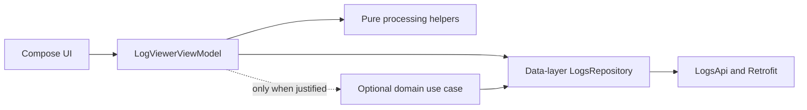
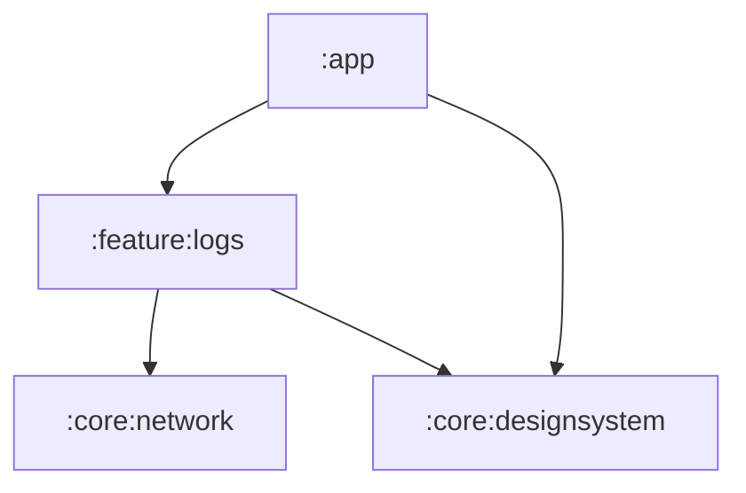
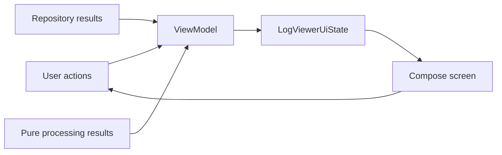

# AI Semantic Log Architecture

## Status and purpose

This document records the approved architecture for the Android take-home challenge. It is the design input for the later development plan; it does not prescribe the final dependency versions, file-by-file implementation sequence, or commit sequence.

The authoritative product inputs remain:

- [`requirement.md`](requirement.md)
- [`api_and_requirement_gap_assumptions.md`](api_and_requirement_gap_assumptions.md)
- [`UIWireframe.png`](UIWireframe.png)

## Architectural position

The application uses [Google's recommended layered Android architecture](https://developer.android.com/topic/architecture/recommendations):

- a clearly defined presentation/UI layer;
- a clearly defined data layer;
- an optional domain layer introduced only when business logic becomes complex or reusable;
- unidirectional data flow from user actions and external data to one immutable screen state;
- repositories owned by the data layer;
- Coroutines and Flow for asynchronous work and state production.

The primary call direction is:



The initial implementation uses the ViewModel as the screen-level business-logic state holder. It calls the data-layer repository contract and delegates focused, deterministic transformations to named utility functions or a small stateless processor. It never calls a remote data source directly. Retrofit APIs, DTOs, repository implementations, and transport exceptions never reach presentation.

This is a pragmatic Google-style two-layer starting point. A domain use case is added only when an operation becomes sufficiently complex to simplify the ViewModel, or when the same business logic must be reused by another ViewModel. No domain package or pass-through use case is created preemptively.

## Scope

The prototype will:

- fetch the supplied approximately 5,000-entry payload in one request;
- validate and map the structured response;
- provide responsive in-memory search across message, tag, and severity;
- group matching logs into UTC minute buckets;
- support newest-first and oldest-first ordering;
- calculate severity counts and error density for the current result set;
- render loading, error, content, no-results, and details states in Compose;
- retain deterministic, testable behavior in light and dark themes.

The prototype will not add runtime AI, semantic/vector search, anomaly detection, pagination, Room, offline caching, live streaming, analytics, or production observability infrastructure.

## Gradle modules

```text
:app
    -> :feature:logs
    -> :core:designsystem

:feature:logs
    -> :core:network
    -> :core:designsystem

:core:network
    -> no app or feature module

:core:designsystem
    -> no app or feature module
```



### `:app`

Owns:

- the `Application` class and Hilt application entry point;
- the single `MainActivity`;
- app-level theme invocation;
- composition of the logs feature.

The app has one activity and one feature destination, so a navigation framework is not introduced.

### `:core:network`

Owns reusable network construction only:

- configured Kotlinx Serialization `Json`;
- `OkHttpClient` construction and timeouts;
- `Retrofit` construction;
- debug-only BASIC request/response logging without response bodies.

It does not know about the logs endpoint, log DTOs, repository failures, or presentation state. Endpoint-specific API declarations and mapping remain feature-owned.

### `:core:designsystem`

Owns:

- fixed light and dark Material 3 palettes;
- typography, shapes, and spacing tokens;
- generic design primitives used across the app;
- log rows and minute-header visuals;
- severity and tag badges;
- the log search field;
- the Canvas severity indicator and legend;
- loading, error, and no-results content;
- the log details sheet.

Dynamic color is excluded so severity colors and visual tests remain deterministic. Design-system components are stateless and accept display-ready values and callbacks. They do not import feature state, repository/data models, ViewModels, or feature resources; this prevents `:core:designsystem` from depending back on `:feature:logs`.

Conceptual component layout:

```text
core/designsystem/
    theme/
    token/
    component/
        LogRow
        LogMinuteHeader
        SeverityBadge
        TagBadge
        LogSearchField
        SeverityIndicator
        LoadingContent
        ErrorContent
        NoResultsContent
        LogDetailsSheet
```

### `:feature:logs`

Contains the data and presentation layers for the only feature. The module exposes one public feature entry composable to `:app`; feature implementation types remain internal. An optional domain package is added later only if a concrete complexity or reuse threshold is reached.

Conceptual package layout:

```text
feature/logs/
    LogsFeature.kt

    data/
        remote/         LogsApi and serializable DTOs
        model/          Repository-facing application data models
        mapper/         DTO validation and mapping
        repository/     LogsRepository and NetworkLogsRepository
        error/          The feature-local typed result and its repository failure
        di/             One feature Hilt module holding the data-layer bindings

    presentation/
        model/          Formatted UI models and flat lazy-list items
        processing/     Pure named helpers or a stateless LogProcessor
        LogViewerAction
        LogViewerUiState
        LogViewerViewModel
        LogViewerScreen
```

The initial scaffold does not create a `domain/` package. If later evidence justifies a use case, the development plan adds the smallest required domain package and redirects only that operation through it.

## Layer responsibilities and dependency rules

### Presentation

Presentation owns screen state production and display concerns:

- `LogViewerViewModel`, `LogViewerUiState`, and `LogViewerAction`;
- UI-only formatting and flat list models;
- screen composition and previews;
- focused pure helpers for search, grouping, sorting, and density calculation;
- localized mapping of repository failures to user-facing text;
- query, sort, retry, and selected-log state.

Presentation may depend on the `LogsRepository` contract and application models exposed by data, plus `:core:designsystem`. It must not call or import `NetworkLogsRepository`, `LogsApi`, Retrofit, OkHttp, DTOs, or data-layer DI modules. If a domain use case is later introduced for an operation, the ViewModel depends on that use case instead of calling the repository for that operation.

### Optional domain

The domain layer is not part of the initial scaffold. ViewModel logic and focused pure utility functions are the default because there is one screen and no demonstrated reuse yet.

A use case is introduced only when at least one of these conditions is present:

- the ViewModel orchestration becomes difficult to read or test as a cohesive unit;
- a business operation coordinates multiple repositories or policies;
- the same business logic is needed by more than one ViewModel;
- threading or error behavior benefits from a reusable boundary.

Any future domain code remains framework-free, stateless, and independent of Compose, Android resources, `Context`, and display formatting. It may depend on the data-layer repository contract. Pass-through use cases and one class per ViewModel action are prohibited.

### Data

Data owns all external-data access and the repository abstraction:

- `LogsApi` and the endpoint definition;
- Kotlinx Serialization DTOs;
- `LogsRepository` and `NetworkLogsRepository`;
- repository-facing application data models;
- DTO validation and mapping;
- conversion of expected network, HTTP, serialization, and schema failures into the repository's typed failure;
- feature Hilt wiring.

Remote DTOs remain internal to data. Unknown JSON keys are ignored. Missing required fields, malformed payloads, or invalid timestamps fail the load rather than producing partially invalid entries.

`NetworkLogsRepository` is named for its data strategy and remains valid if the HTTP client implementation changes.

## Data contracts

The repository-facing data contains the following concepts:

```text
LogBatch
    reportedTotalCount
    sessionId
    entries

LogEntry
    id
    timestamp: Instant
    severity
    tag
    message
    metadata

LogMetadata
    latencyMs
    isAiGenerated

Severity
    DEBUG, INFO, WARN, ERROR, FATAL, UNKNOWN
```

DTO timestamps and severity values remain strings until mapping. Mapping parses timestamps to `Instant` and converts unrecognized severity values to `UNKNOWN`. A mismatch between `reportedTotalCount` and the mapped entry count does not discard otherwise usable data; displayed counts use the actual entry collection.

`LogsRepository.getLogs()` is a one-shot suspending operation returning a typed result. A single Retrofit response is not wrapped in a repository `Flow`; Flow is used by the presentation state-production pipeline where values change over time.

## Error handling

Expected failures are converted at the data boundary into one feature-local typed failure. Unavailable connectivity, timeout, an unsuccessful HTTP response, invalid or incompatible response data, and otherwise unclassified data-access failures all collapse into that single value.

The failure is deliberately not a classified hierarchy. The application's answer to a failed load is the same retryable error presentation whatever caused it, so a finer taxonomy would encode a distinction no caller acts on. A case is split out only when a consumer genuinely behaves differently for it — for example, if retry policy or user-facing copy ever has to diverge by cause.

Coroutine cancellation is always rethrown and is never converted into a load failure. Presentation receives the stable typed repository failure without seeing transport exceptions and maps it to localized error content and retry behavior. A future use case may translate the failure only when it adds meaningful policy.

The typed result wrapper carrying that failure stays inside `:feature:logs`. It is a result convention rather than network infrastructure, so it does not belong in `:core:network`; it moves to a neutral shared module only if a second feature genuinely needs it.

## Processing policy

The ViewModel coordinates processing, while focused utility functions or a stateless `LogProcessor` perform deterministic transformations. The loaded collection is prepared once so repeated searches do not repeatedly normalize every field or re-sort all 5,000 entries. Processing remains independent of Compose and Android framework types and is directly unit-testable.

Behavioral rules:

- matching is case-insensitive substring search across message, tag, and severity;
- blank search returns the complete collection;
- logs are grouped by their UTC minute;
- groups and rows use the selected chronological direction;
- timestamp and ID provide deterministic tie-breaking;
- all severity counts are calculated for the displayed result set;
- error density is `(ERROR + FATAL) / displayed entries`;
- an empty result has `0%` density;
- `UNKNOWN` contributes to the denominator but not the error numerator.

Search text is reflected in screen state immediately. Only result processing is debounced and made cancellable. The exact Flow operators, debounce timing, and dispatcher wiring belong to the development plan rather than this architecture document.

CPU-heavy mapping and processing must be main-safe and run on an appropriate background dispatcher supplied in a testable way.

## Unidirectional presentation state

`LogViewerViewModel` is the screen-level state producer. It receives actions, calls the repository contract, coordinates pure processing helpers, and exposes one immutable `StateFlow<LogViewerUiState>`. It may invoke a domain use case later if an operation meets the documented extraction criteria.



The state contains the current query, sort order, selected log, and one mutually exclusive load state:

- `Loading`;
- `Error`;
- `Content`.

Content includes the flattened grouped rows, result count, and severity summary. A filtered empty result is valid content, not a load error. Selection is durable screen state that drives the modal details sheet, not a one-time event, so no event channel is required.

The root composable obtains the Hilt ViewModel and collects state with lifecycle awareness. The screen composable receives only state and an action callback, making it previewable and directly testable.

`LogViewerScreen` assembles the screen from components exported by `:core:designsystem`. Presentation maps application data into display-ready values before passing them to those components.

## UI architecture

The UI follows the supplied wireframe while remaining responsive:

- a centered single-pane layout on phones and wider windows;
- fixed light/dark Material 3 palettes;
- loading skeletons without fabricated log values;
- an error state with Retry;
- a content state with severity summary, search, result count, sort toggle, and one flat `LazyColumn`;
- regular, non-collapsible minute headers;
- stable, unique keys and content types for headers and log rows;
- a dedicated no-results presentation that retains the active search field;
- a modal bottom sheet for the selected log.

All leaf visual components—including log rows, minute headers, severity and tag badges, search UI, the Canvas severity indicator, loading/error/no-results content, and the details sheet—live in `:core:designsystem`. `:feature:logs` owns their screen-level arrangement, state mapping, and action wiring.

The details sheet displays severity, complete message, tag, full UTC timestamp, latency, AI-generated flag, log ID, and the response-level session ID.

The Canvas severity indicator uses a neutral circular track plus separate ERROR and FATAL arcs. Their combined sweep represents error density; the center displays the combined percentage, and an adjacent legend presents severity counts. Text labels ensure that meaning is not conveyed by color alone.

The details sheet supports close, swipe-down, and Back dismissal.

## Time and formatting

The source timestamps are UTC instants and remain UTC throughout the feature:

- processing groups by minute-truncated UTC instants;
- minute headers use `HH:mm`;
- row timestamps use `ss.SSS` because the minute already appears in the header;
- details use the complete UTC instant.

Display formatting occurs in presentation before composition. Compose receives UI-ready strings and flat list items rather than formatting or transforming application data during rendering.

## Dependency injection

Hilt is the application DI framework.

- `:app` provides the Hilt application and activity entry points.
- `:feature:logs` provides the endpoint API, repository, processing helpers, optional future use cases, and dispatchers. Its data-layer bindings live in one module rather than one module per binding; modules are split only when they separate real lifetimes or ownership.
- Constructor injection is preferred.
- Mutable or expensive dependencies are scoped only when their lifecycle requires it.
- `:core:network` remains unaware of feature types.

## Verification strategy

The architecture supports four complementary test levels:

1. Pure JVM tests for presentation processing utilities: search, grouping, sorting, deterministic ties, severity counts, density, and UTC boundary behavior.
2. MockWebServer integration tests for the real Retrofit/Kotlinx Serialization/repository path and typed failure mapping.
3. ViewModel JVM tests for loading, success, error/retry, search state, processed results, sorting, selection, and dismissal.
4. Paparazzi visual tests for design-system components and assembled screen states, plus a small instrumented Compose test suite for major interactions.

Fakes are preferred over mocking frameworks. JUnit 4 is used consistently with AndroidJUnitRunner and Compose rules, with AssertK, Turbine, and `kotlinx-coroutines-test` for local tests.

CI remains host-only: unit tests, Android Lint, ktlint, Paparazzi verification, application assembly, and compilation of instrumented test sources. Device execution of Compose tests remains a documented local acceptance step.

## Commit-time quality gate

Every local commit runs code-quality checks through a repository-owned pre-commit hook:

```text
.githooks/pre-commit
    -> ./gradlew ktlintCheck lintDebug
```

The hook exits non-zero and blocks the commit when ktlint or Android Lint reports a failure. It checks only; it does not silently format, modify, stage, or commit files.

Because Git does not automatically activate repository hooks after clone, project setup must run:

```bash
git config core.hooksPath .githooks
```

The hook is installed before the first implementation commit. It is a fast local feedback gate, not the sole enforcement mechanism. CI repeats ktlint and Android Lint because hooks can be absent or bypassed. The development plan must create the hook, make it executable, document installation in `README.md`, and verify both its passing and commit-blocking behavior.

## Build and platform constraints

- Namespace and application ID: `com.example.fgfchallenge`.
- Minimum SDK: 26.
- Gradle runs on JDK 21.
- Application bytecode targets Java 17.
- Kotlinx Serialization is used for JSON.
- Hilt uses KSP rather than kapt.
- Dependency versions are pinned in `libs.versions.toml`; dynamic versions are prohibited.
- Shared root Gradle configuration is preferred over a build-logic module for this four-module project.

The development plan must select and verify one mutually compatible AGP, Gradle, Kotlin, Compose, Hilt/KSP, Retrofit/OkHttp, and Paparazzi matrix before scaffolding. Version selection is deliberately deferred because it is an implementation/tooling compatibility decision, not an architectural boundary.

## Documentation and delivery constraints

- `README.md` will contain project overview, setup—including pre-commit hook activation—commands, architecture, assumptions, screenshots, test strategy, performance decisions, and the required app recording.
- `PROMPTS.md` will be a structured audit log of meaningful AI-assisted work, including date, task, human prompt, AI contribution, affected areas, and human verification.
- The original requirement, assumptions, and wireframe remain in the repository as source material.
- Comments and KDoc explain non-obvious contracts and invariants rather than narrating self-explanatory code.
- Recording format may be selected after the UI is stable, but a working README recording and the final GitHub push remain release requirements.

## Development-plan handoff

The later development plan must derive its tasks from this document and provide:

- the exact dependency/toolchain matrix;
- the final source-file map and public interfaces;
- pre-commit hook creation, activation, and pass/fail verification before implementation commits;
- test-first implementation steps and verification commands;
- independently reviewable task boundaries and commits;
- requirement-to-task traceability;
- final manual acceptance, recording, documentation, and GitHub delivery steps.
