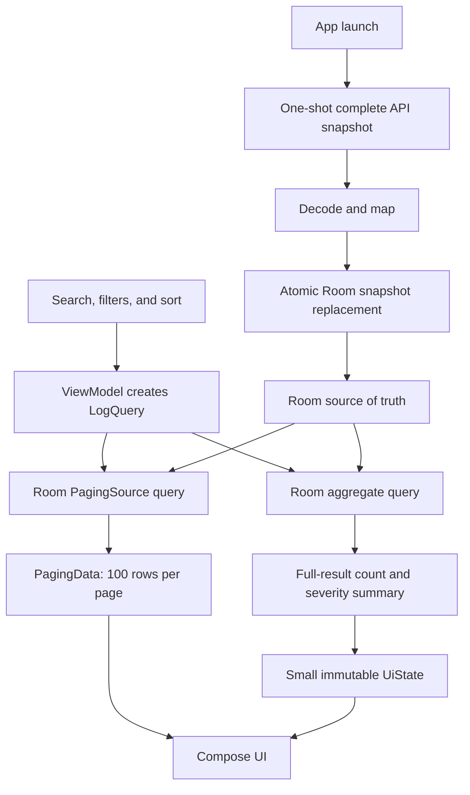

# AI Semantic Log Implementation Roadmap

## Summary

Build the app as a sequence of usable, independently verifiable increments. Steps 1–5 established the original approximately 5,000-record prototype foundation. The revised work continues from that baseline with a Room-backed, query-driven log viewer that keeps the active UI working set bounded without turning performance work into a separate project.

The revised target is:

> Fetch the complete remote snapshot once per app launch, decode and map it, atomically replace the local Room snapshot, query Room with all active search and filter conditions, display the newest 100 matching logs first, and progressively load additional matching logs in pages of 100.

[`requirement.md`](requirement.md), [`api_and_requirement_gap_assumptions.md`](api_and_requirement_gap_assumptions.md), [`UIWireframe.png`](UIWireframe.png), and [`ARCHITECTURE.md`](ARCHITECTURE.md) remain the repository's documentation authority in that order. Step 6 aligned all four with the approved large-dataset revision; this roadmap now sequences implementation without overriding those product and architecture contracts.

This roadmap deliberately defines coherent milestones, responsibilities, and exit goals rather than dependency versions, exact source files, or commit-sized implementation steps.

## Current Delivery Status

| Step | Status | Delivered baseline |
| --- | --- | --- |
| 1. Project foundation | Complete | Four-module project, toolchain, Hilt, Compose, CI, and quality gates. |
| 2. Design system and UI components | Complete | Stateless log-viewer components, deterministic themes, previews, and component tests. |
| 3. Fixture-backed screen UI | Complete | Full screen states, flat grouped list, responsive layouts, and visual tests. |
| 4. Basic UI interaction | Complete | Immutable state/actions, ViewModel, sort/query input, and details-sheet interaction. |
| 5. Network foundation and repository boundary | Complete baseline | Retrofit/OkHttp, endpoint, DTO mapping, one feature-local typed repository failure, cancellation preservation, Hilt wiring, and repository tests. This one-source repository contract is transitional and is expanded in Step 8. |
| 6. Product and architecture contract alignment | Complete | Requirement, assumptions, wireframe, architecture, data convention, and contributor guidance now describe one Room/Paging prototype system. |
| 7–13. Query-driven implementation | Not started | Room, Paging 3, combined queries, refresh coordination, simple ViewModel coordination, updated UI, basic responsiveness checks, and focused verification. |

## Revised Target Architecture

The architecture must preserve these invariants:

- The remote endpoint still returns one complete snapshot; remote pagination and streaming are not introduced.
- Every app launch attempts one complete refresh. A user retry may start another attempt after a failure.
- The old Room snapshot is replaced only after the response has decoded and mapped successfully.
- Snapshot replacement is one transaction. A network, decoding/mapping, cancellation, or database failure must not leave an empty or partially replaced database.
- Room is the only source used by search, filters, result counts, severity aggregates, details lookup, and list presentation after refresh succeeds.
- `PagingData` owns the bounded list working set. `LogViewerUiState` must never contain the complete database or a materialized copy of every matching row.
- The paged list and aggregate summary use the same immutable query criteria and logically identical predicates.

## Implementation Roadmap

### 1. Project foundation — Complete

**Work delivered**

- Established `:app`, `:feature:logs`, `:core:network`, and `:core:designsystem`.
- Configured the compatible toolchain, Compose, Hilt/KSP, Retrofit, serialization, tests, CI, and the repository-owned pre-commit gate.
- Established module dependency rules, the theme entry point, and a launchable application shell.

**Exit goal**

- The minimal application builds, launches, and passes the host-side quality gates before feature work.

### 2. Design system and UI components — Complete

**Work delivered**

- Defined deterministic light/dark colors, typography, shapes, spacing, and severity styling.
- Added stateless reusable rows, minute headers, badges, search, loading, error, empty-result, details-sheet, and Canvas severity components.
- Added representative previews and component-level tests across relevant widths and themes.

**Exit goal**

- Presentation can assemble the log viewer without embedding feature/data models or business calculations in the design system.

### 3. Fixture-backed screen UI — Complete

**Work delivered**

- Assembled loading, error, populated, filtered, and filtered-empty states from realistic fixture data.
- Rendered grouped content in one flat `LazyColumn` with stable keys and content types.
- Added responsive and light/dark visual verification.

**Exit goal**

- The complete visual shell is reviewable and testable independently of networking and real query processing.

### 4. Basic UI interaction — Complete

**Work delivered**

- Added immutable screen state and user actions for query input, sorting, retry, selection, and dismissal.
- Connected row selection to the details sheet, including close, swipe, and Back dismissal.
- Established one Hilt-backed ViewModel as the owner of interaction state.

**Exit goal**

- All existing interactions travel through unidirectional state and action boundaries that can be evolved without moving business state into composables.

### 5. Network foundation and repository boundary — Complete baseline

**Work delivered**

- Configured the shared Retrofit/OkHttp client and feature-owned logs endpoint.
- Implemented the one-shot suspending request, DTO mapping, repository-facing application models, and feature-local typed result/failure boundary.
- Converted connectivity, timeout, HTTP, serialization, schema, and unknown failures into the repository's single retryable failure while preserving coroutine cancellation.
- Wired the current API and `NetworkLogsRepository` through Hilt and covered the boundary with MockWebServer and fake-API tests.

**Exit goal**

- Transport types and exceptions stop at the data boundary. This milestone remains reusable as the remote side of the Room-backed repository introduced in Step 8.

### 6. Align the revised product and architecture contracts — Complete

**Work delivered**

- Revised the authoritative requirement, assumptions, architecture, and wireframe documents to replace the previous 5k in-memory position with the Room/Paging prototype design.
- Recorded the exact search scope: case-insensitive literal substring matching over `message` and `id` only.
- Recorded the structured-filter semantics: AND between categories, OR/`IN` within multi-select categories, and no predicate for an inactive category.
- Defined the default as no search or filters, newest-first ordering, and the most recent 100 matching records as the initial page.
- Defined startup refresh as one complete network request per app launch followed by an atomic Room snapshot replacement. Retry is explicit after failure.
- Defined result count, severity counts, and error density as aggregates over the complete filtered database result rather than the loaded pages.
- Replaced the former Room, pagination, and database-query non-goals. Kept remote pagination, streaming, runtime AI, vector search, anomaly detection, analytics, and production observability out of scope.
- Updated the wireframe for startup refresh/error, filter entry, active-filter indication, filter controls, Paging load states, no results, details, and aggregate-summary behavior before UI implementation.
- Aligned the project-specific data-layer convention and `AGENTS.md` guidance so later contributors receive the same contract.

**Exit goal**

- All authoritative documents describe one implementable system. No developer must choose between the old in-memory architecture and the revised Room-backed requirements.

### 7. Room source of truth and reusable query engine

**Work**

- Add Room and Paging 3 to `:feature:logs`; keep the database feature-owned because no other feature consumes log storage. Do not add a generic `:core:database` module without a second consumer.
- Define an internal persistence entity for every queryable field: ID, UTC timestamp, severity, tag, message, latency, AI-generated flag, and response session ID.
- Add the Room database, DAO, entity mapping, bindings in the existing feature-owned `LogsDataModule`, and the small set of indexes needed by the implemented queries. Split another DI module only if ownership, component, or lifetime genuinely differs; add further indexes only when the supplied fixture exposes an actual need.
- Store timestamps in a persistence representation that preserves exact UTC ordering and deterministic timestamp/ID tie-breaking.
- Implement a parameterized predicate builder shared by the paged-select and aggregate-select paths. Never concatenate user input into SQL.
- Escape SQLite wildcard characters so search text is treated as a literal case-insensitive substring rather than an accidental `%` or `_` pattern.
- Implement all combined conditions:
  - `(message contains query OR id contains query)`;
  - `tag IN selectedTags`;
  - `severity IN selectedSeverities`;
  - `isAiGenerated = selectedValue` when constrained;
  - UTC timestamp within the active range;
  - latency within the active inclusive range.
- Represent UI date/time choices as one UTC half-open interval. The selected end minute is inclusive to the user and is converted to the next minute as the exclusive database bound; a date-only end includes the complete selected day.
- Return a `PagingSource` ordered by timestamp and ID in the selected deterministic direction.
- Add aggregate queries using the identical predicate to return total result count, per-severity counts, and the values needed for `(ERROR + FATAL) / total` density.
- Expose unfiltered filter-option data needed by the UI, including available tags and the dataset latency bounds, without loading every log row.

**Exit goal**

- Room can answer every supported query directly, produce a deterministic paged stream, and calculate full-result aggregates whose criteria cannot drift from the list criteria. Keep focused DAO tests for the supported query behavior and an empty result; a full combinatorial matrix is not required.

### 8. Network-to-Room refresh and repository coordination

**Network/data-layer work**

- Retain Retrofit/OkHttp as a one-shot remote source. Do not simulate server pagination or expose remote DTOs outside data.
- Evolve the current single-source `NetworkLogsRepository` into a repository that coordinates the remote endpoint and the feature-owned Room database; rename the implementation so its name reflects the new multi-source strategy.
- Split the repository contract into operations with distinct lifecycles:
  - a suspending startup refresh that fetches, maps, and replaces the snapshot;
  - a Flow of `PagingData` for an immutable query;
  - a Flow of full-result aggregate summary for the same query;
  - a focused lookup for selected-log details and filter options.
- On every app launch, run one full refresh before treating content as current. Decode and map the response before mutating Room.
- Replace the old snapshot inside one database transaction. Delete/replace and batched inserts may occur within that transaction, but observers must see either the old complete snapshot or the new complete snapshot—never an intermediate state.
- Keep the prior snapshot intact when the network request, decoding/mapping, transaction, or database write fails. Present the launch as a retryable refresh failure rather than silently claiming the retained snapshot is current.
- Translate Room/SQLite failures into the existing feature-local repository failure while every caller uses the same retry behavior. Add a distinct local failure case only if presentation or recovery later behaves differently. Continue to rethrow coroutine cancellation before broad exception handling.
- Keep network decoding, mapping, and database writes main-safe. Avoid creating unnecessary application/UI copies during import where bounded mapping or batched insertion is sufficient.

**Network/data-layer exit goal**

- A successful launch leaves Room with the latest mapped remote snapshot and automatically invalidates database query streams. A failed or cancelled launch leaves the previous snapshot unchanged. Presentation depends only on the repository contract and never on the API, DAO, DTO, entity, Retrofit, Room, or SQLite.

### 9. Keep query coordination simple

This one-screen prototype does not justify a standalone domain layer. Keep the immutable repository `LogQuery` as the common input for Paging and aggregate operations, but derive it directly in the ViewModel from the current screen state.

**Work**

- Normalize inactive search/filter values while creating `LogQuery`.
- Coordinate the repository's paged stream and aggregate-summary stream from the same query value.
- Replace obsolete row and summary collections when a new query becomes active so previous results are not labelled as current.
- Do not add a domain package, use case per UI action, or pass-through wrapper unless a later feature creates genuine reuse.

**Exit goal**

- The ViewModel remains understandable and drives matching paged and aggregate streams from one query value without another architectural layer.

### 10. Paging-aware presentation state and ViewModel

**Work**

- Replace fixture-owned list content with repository-backed data.
- Keep exactly one immutable `StateFlow<LogViewerUiState>` for small screen state: immediate query text, applied filters, filter draft/visibility, sort, startup refresh state, aggregate summary, filter options, and selected-log state.
- Expose the list as a separate `Flow<PagingData<LogViewerListItem>>`; never place `PagingData`, all database rows, or all matching UI models inside `LogViewerUiState`.
- Configure Paging with `pageSize = 100`, `initialLoadSize = 100`, placeholders disabled, and a prefetch distance that requests the next page around the final 20–30 rows rather than waiting for item 100.
- Map database/application rows into display-ready models and insert UTC minute headers in the Paging transformation while preserving stable log IDs, content types, and deterministic timestamp/ID ordering across page boundaries.
- Replace selection lookup over the in-memory flat list with a repository-backed lookup by log ID so details remain correct regardless of which pages are currently loaded.
- Make startup refresh, retry, rapid query replacement, sort changes, filter application/clearing, summary updates, selection, and dismissal explicit in the state/action reducer.
- Prevent stale summary values from a previous query from being presented as belonging to a newer Paging generation.

**Exit goal**

- Presentation memory is bounded by Paging rather than total dataset or match count. Query/filter changes cancel obsolete work, the list and summary always correspond to the same criteria, and details do not depend on retaining previously loaded rows in `UiState`.

### 11. Structured-filter UI and paged list integration

**UI work**

- Keep search-as-you-type as a dedicated field that searches `message` and `id` only. Remove any legacy implication that free text searches tag or severity.
- Add a Filter action with an active-filter count and a modal filter sheet containing:
  - multi-select tag chips populated from Room filter options;
  - multi-select `DEBUG`, `INFO`, `WARN`, `ERROR`, and `FATAL` severity chips;
  - an AI-generated tri-state control for Any, Yes, and No;
  - Material 3 date-range selection plus start/end time pickers;
  - a Material 3 `RangeSlider` for inclusive minimum and maximum latency;
  - Apply and Clear All actions so partially edited values do not issue database queries until committed.
- Preserve the default state: blank search, no structured filters, and newest-first ordering.
- Render Paging content in one flat `LazyColumn` using Paging-aware stable keys and content types, regular non-collapsible UTC minute headers, and existing design-system rows.
- Add distinct UI for startup refresh loading/error, page refresh, append progress, and append retry. Reaching an append failure must not discard already loaded rows.
- Show the dedicated no-results state only after the current query has completed with a full-result count of zero.
- Display result count and severity/error density from the aggregate query over the complete filtered database result, never from `LazyPagingItems.itemCount` or the currently loaded pages.
- Keep filter/search controls and the aggregate summary visible while scanning the paged list, and preserve the details sheet's close, swipe, and Back behavior.
- Keep one representative Paparazzi screenshot test per screen to demonstrate visual verification. Retain the existing instrumented coverage without adding interaction or new instrumented-test work.

**UI exit goal**

- A user can compose every supported condition, see which filters are active, receive full-result counts and density, and scroll beyond the first 100 matches without a visible page-boundary stall during normal use. The UI never computes database aggregates or assumes that loaded item count equals result count.

### 12. Basic responsiveness check

**Work**

- Keep database, mapping, and import work off the main thread and avoid putting all matches in `UiState`.
- Exercise the supplied fixture manually after the core flow works. Address only visible responsiveness problems that block the prototype demonstration.
- Keep the initial parameterized Room/SQLite `LIKE` implementation; do not add alternate search technology, query-plan analysis, synthetic 100k data, or optimization work without an observed need.

**Exit goal**

- The supplied fixture supports the normal search, filter, list, and details demonstration without an obvious UI stall. No device benchmark or performance evidence is required.

### 13. Focused verification and delivery

**Work**

- Keep focused data/repository tests for supported query behavior, successful replacement, and a retryable failure.
- Keep ViewModel tests for the main loading/error/retry and details-selection paths.
- Add one representative Paparazzi screenshot test per screen. The current instrumented coverage is sufficient; no additional interaction-test work is required.
- Run the existing JVM checks, screenshot verification, lint, ktlint, and application assembly. Keep current instrumented-test compilation without expanding it into a new test initiative.
- Update `README.md`, `PROMPTS.md`, screenshots or recording, setup instructions, and final delivery checks. Performance evidence is not required.

**Exit goal**

- Focused automated checks and a manual demonstration cover the launch-refresh, query/filter, list, retry, and details flows. Delivery documentation accurately describes the prototype scope.

## Layer Outcomes

### Network and data layer

**Must do**

- Fetch one complete snapshot on every app launch.
- Decode and map before mutation, then atomically replace Room.
- Make Room the source of truth for paged rows, summaries, filter options, and details.
- Expose typed refresh, query, aggregate, and lookup contracts without leaking infrastructure.
- Preserve the old complete snapshot on any failed or cancelled replacement.

**Target outcome**

- Remote transport remains simple and one-shot, while all repeated work becomes indexed, cancellable, database-backed querying over a consistent local snapshot.

### Domain layer

**Prototype position**

- No standalone domain layer is required. The ViewModel derives the immutable `LogQuery` and coordinates the repository's paired streams directly.
- Do not add use cases or pass-through wrappers unless a later feature creates real reuse.

### UI layer

**Must do**

- Replace the materialized fixture/list state with Paging-aware rendering and a small immutable state.
- Add independent structured-filter controls while limiting free-text search to message and ID.
- Render full-result aggregates separately from loaded-page state.
- Represent the main loading, content, empty, error, retry, and details states clearly and responsively.

**Target outcome**

- The screen remains responsive and scan-friendly over approximately 100,000 stored logs while accurately communicating the complete query result, not merely the rows currently held in memory.

## Important Interfaces and Policies

- `LogsFeature` remains the only feature entry point exposed to `:app`.
- `LogsRepository` remains the sole data-layer boundary. Its old `getLogs()` contract is replaced by startup refresh, paged-query, aggregate-query, filter-option, and selected-log lookup operations.
- DAO, Room entities, remote DTOs, Retrofit/OkHttp types, Room/SQLite exceptions, and query builders remain internal to data.
- One immutable canonical query value drives both `PagingSource` and aggregate queries.
- `LogViewerUiState` contains only bounded screen state. Paged list content travels separately as `Flow<PagingData<LogViewerListItem>>`.
- `PagingConfig` uses 100 rows for both initial and subsequent page sizes and prefetches before the end of the loaded window.
- `LogViewerAction` covers query changes, filter editing/application/clearing, sorting, startup retry, Paging retry, selection, and dismissal.
- Details-sheet visibility is derived from selected-log state, and selected details are resolved by stable log ID rather than by scanning loaded pages.
- Design-system components remain stateless, display-ready, and independent of feature, repository, Room, and Paging types.

## Revised Acceptance Scenarios

- Each app launch performs one complete refresh; a successful second launch replaces rather than duplicates the previous snapshot.
- Network, decoding/mapping, cancellation, and database failures leave the previous complete snapshot intact and expose the correct retryable state.
- Default query has no conditions, sorts newest first, initially loads exactly 100 rows, and prefetches the next 100 before the first page is exhausted.
- Search is case-insensitive literal substring matching over message or ID only; tag and severity participate only through structured filters.
- Multiple tags and severities use OR/`IN`; active categories combine with AND; inactive categories add no restriction.
- AI-generated, UTC date/time, and inclusive latency filters work independently and in combination.
- Result count and every severity count describe the complete filtered result even when only 100 rows are loaded.
- Error density is `(ERROR + FATAL) / complete filtered count`; an empty result is 0%; unknown severities remain valid data but are not silently classified as errors.
- Paging preserves deterministic UTC minute grouping and timestamp/ID order across page boundaries.
- Rapid search/filter replacement cannot display rows or summaries from an obsolete query.
- Row selection opens correct details even when the row belongs to a later page; close, swipe, and Back dismiss the sheet.
- The supplied fixture can be refreshed, queried, paged, and scrolled without materializing the full result set in UI state or an obvious UI stall during the prototype demonstration.

## Assumptions and Defaults

- The remote response is one authoritative complete snapshot, not a delta. Each successful launch replaces the prior local snapshot.
- Room is required as the local source of truth and Paging 3 is required for list delivery; neither remains a non-goal.
- The initial implementation keeps feature-specific persistence inside `:feature:logs`.
- No standalone domain layer is required; repository contracts remain owned by data and the ViewModel derives the immutable query input.
- Search begins with parameterized Room/SQLite `LIKE`; do not add alternate search technology without an observed prototype need.
- Material 3 date/range and time pickers plus `RangeSlider` are the standard controls for date/time and latency filtering.
- Sorting remains deterministic and defaults to newest first.
- The prior Room snapshot is retained for atomicity and recovery after refresh failure, but a failed launch is not reported as a successful current snapshot.
- Testing remains focused: retain existing instrumented coverage, keep core data/ViewModel checks, and demonstrate visual verification with one screenshot per screen.
- Dependency versions are selected and pinned during the relevant implementation plan; this roadmap intentionally does not prescribe a version matrix.
